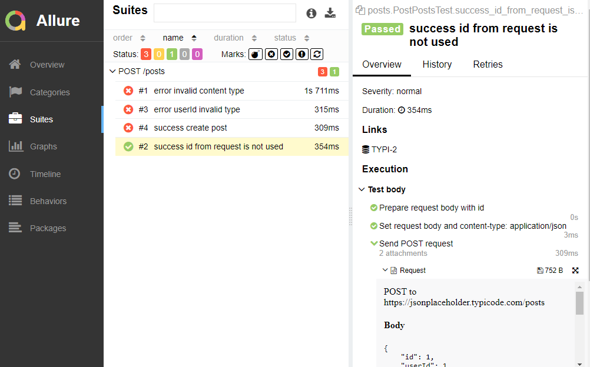

# restAssured2023

Example REST API test automation. Example defect reports and test cases.

### Stack:

- Java
- Maven
- JUnit
- RestAssured
- Allure

### Files:

- Example POST tests: [PostPostsTest.java](src/test/java/posts/PostPostsTest.java)
- Example bug reports: [PostPostsIssues.md](src/test/resources/bugs/PostPostsIssues.md)
- Example testcases: [PostPostsTestCases.md](src/test/resources/testCases/PostPostsTestCases.md)
- Example Allure report: [index.html](target/site/allure-maven-plugin/index.html) (needs server to open)
  